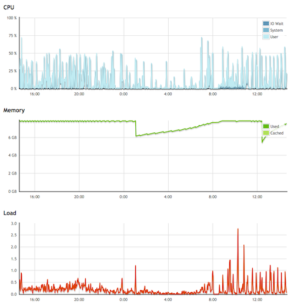
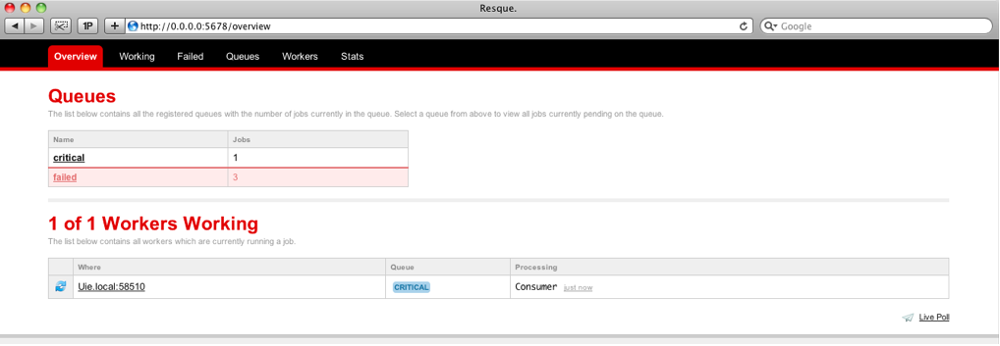

!SLIDE

# Redis Use Cases #

!SLIDE bullets

* Caching
* Session storage

!SLIDE

# But these are boring. #
# Show me the real stuff! #

!SLIDE bullets incremental

* Sharing data across processes
* Worker queues
* Statistical data
* Who's online
* Webworkers (with Node.js)

!SLIDE

# Examples #
## Sharing data across processes ##

!SLIDE bullets incremental scalarium

# Security #

* Internal messages get a request token
* Stored in Redis before sending
* Removed on successful delivery

!SLIDE bullets incremental scalarium

# Security #

* Internal and external messaging is encrypted
* Certificates and identities stored in Redis
* Available for all processes

!SLIDE ruby

# Sharing data #

    @@@ ruby
    # Process 1
    @redis.setnx("a_secret", "message")
    
    # Process 2
    @redis.get("a_secret")

!SLIDE bullets incremental

# Sharing data is useful for... #

* Feature flipping
* Central and dynamic configuration
* Additional (and simple) object meta data
* Sending data from background to web processes (and vice versa)

!SLIDE

# Examples #
## Statistical Data ##

!SLIDE scalarium incremental bullets

 
  
# Tracking Instance Hours #

* Track start time of an instance
* When stopped, calculate computing hours
* And add to several sets

!SLIDE scalarium bullets incremental

# Statistics #

* Instances collect monitoring data
* Stored in a list in Redis
* Kept at a limit using LTRIM

!SLIDE scalarium center

 
 
# Statistics #

!SLIDE

## Statistics can require a lot of reverse lookup structures. ##

!SLIDE

# Examples #
## Worker queues ##

!SLIDE bullets incremental

# Resque #

* A worker queue for Ruby based on Redis
* Jobs are pushed to and popped off a list ("queue")

!SLIDE ruby

# Worker #

    @@@ ruby
    class Consumer
      @queue = :critical

      def self.perform(*args)
        args.each do |produce|
          puts "Consuming #{produce}"
        end 
      end 
    end

!SLIDE ruby

# Producer #

    @@@ ruby
    Resque.enqueue(Consumer, 'nutella', 'jam')

!SLIDE center

!SLIDE

# Web workers #

## Study has shown: ##
## 90% of all web workers would choose Redis. ##
